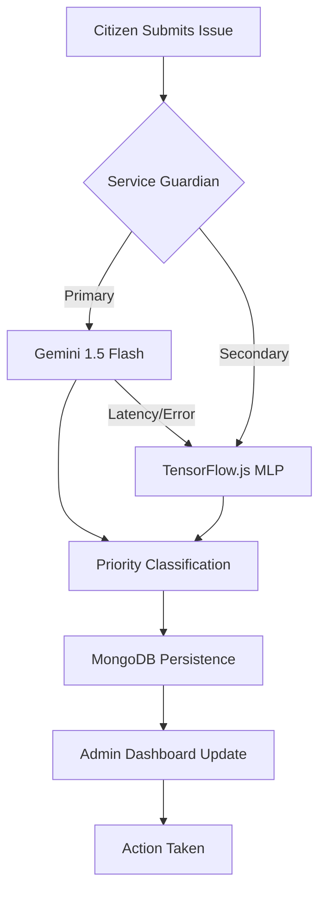
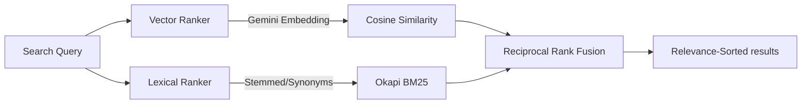

<div align="center">
  <h1>CivicConnect</h1>
  <p><strong>Intelligent, Fault-Tolerant Civic Issue Tracker & Triage Engine</strong></p>

  
  
  
  
  
  
  
  <br/>
  <br/>
  <a href="http://civicconnect-frontend.s3-website-us-east-1.amazonaws.com/" target="_blank">
    
  </a>
</div>

## 📖 Overview

CivicConnect is a high-availability platform engineered to streamline municipal issue tracking by bridging the gap between citizens and local authorities. Unlike standard CRUD applications, CivicConnect is designed around a **"Dual-Layer Intelligence"** architecture. It utilizes state-of-the-art Large Language Models (LLMs) for primary semantic routing and prioritization, while maintaining mathematically rigorous, locally hosted machine learning and lexical algorithms as fail-safes. This ensures continuous triage and search availability even during upstream API outages or aggressive rate limiting.

---

## 🏗️ System Architecture

The infrastructure decouples client ingestion from heavy analytical workloads, utilizing a hybrid search and routing pipeline.

### Issue Triage Pipeline


### Hybrid Search Engine


---

## 🧮 Mathematical & Algorithmic Architecture

The core of CivicConnect relies on objective mathematical models to ensure data retrieval and categorization are both accurate and resilient.

### 1. Primary Vector Search (Semantic)
The primary search mechanism converts natural language into high-dimensional vectors using Google's `gemini-embedding-001` model. To determine the relevance between a user's query vector ($A$) and a stored complaint vector ($B$), the system calculates the **Cosine Similarity**:

$$
\mathrm{similarity}=\cos(\theta)=\frac{A\cdot B}{|A||B|}=\frac{\sum_{i=1}^{n}A_i B_i}{\sqrt{\sum_{i=1}^{n}A_i^2}\sqrt{\sum_{i=1}^{n}B_i^2}}
$$

### 2. The Fallback: BM25 Lexical Search
When semantic embeddings are unavailable, the system defaults to a custom implementation of the **Okapi BM25** algorithm. Unlike standard TF-IDF, BM25 utilizes term frequency saturation to prevent document length from disproportionately skewing results. For a query $Q$ containing keywords $q_i$, the score of document $D$ is:

$$
\mathrm{score}(D,Q)=\sum_{i=1}^{n}\mathrm{IDF}(q_i)\cdot\frac{f(q_i,D)\cdot(k_1+1)}{f(q_i,D)+k_1\cdot(1-b+b\cdot\frac{|D|}{\mathrm{avgdl}})}
$$

Where:
* $k_1=1.2$ (term frequency saturation) and $b=0.75$ (length normalization).
* $|D|$ is the length of the document, and $\mathrm{avgdl}$ is the average document length across the corpus.

### 3. Reciprocal Rank Fusion (RRF)
To merge results from the Vector Search (normalized $0-1$) and BM25 (unbounded absolute scores), CivicConnect utilizes **RRF**, which relies on rank positional data ($r$) rather than raw algorithmic scores:

$$
\mathrm{RRF\_Score}(d)=\sum_{r\in R}\frac{1}{k+r(d)}
$$

*(With $k=60$ to smoothly penalize lower-ranked documents and prevent ranker bias).*

### 4. Local Neural Network Fallback (@tensorflow/tfjs)

For urgency scoring, if the Gemini LLM is unavailable, a local **Multi-Layer Perceptron (MLP)** executes the triage:

1.  **Feature Extraction:** Text is parsed through a TF-IDF vectorizer:

$$
\mathrm{TF-IDF}(t,d,D)=\mathrm{TF}(t,d)\times\log\left(\frac{N}{|\{d\in D:t\in d\}|}\right)
$$

2.  **Architecture:** The vector is passed through a `96 ➔ 48 ➔ 24 ➔ 1` dense layer architecture.
3.  **Activation:** Hidden layers utilize **ReLU** $f(x)=\max(0,x)$ to prevent vanishing gradients, while the final output layer utilizes a **Sigmoid** activation:

$$
\sigma(x)=\frac{1}{1+e^{-x}}
$$

---

## 🚀 Core Features

- **Automated Triage Routing:** Automatically assigns incoming complaints a priority tier using AI, immediately escalating infrastructure emergencies.
- **Fault-Tolerant Infrastructure:** Dual-layer search and classification guarantees system uptime during external service degradation.
- **Spatial Tracking:** Integrates **Nominatim** (OpenStreetMap) to geocode issues, attaching precise longitude/latitude coordinates.
- **Secure Administrator RBAC:** Enforces strict Role-Based Access Control, utilizing stateless JWT Bearer Token authentication for cross-domain security and precise status management.

---

## 🛠️ Tech Stack

| Category | Technologies |
| :--- | :--- |
| **Frontend** | React, Vite, Tailwind CSS |
| **Backend API** | Node.js, Express.js |
| **Database & ORM** | MongoDB Atlas, Mongoose |
| **Artificial Intelligence** | Gemini API (Generative AI & Embeddings) |
| **Machine Learning** | TensorFlow.js, Custom TF-IDF/BM25 |
| **Cloud Hosting** | AWS S3 (Client), AWS EC2 (API) |
| **Storage** | AWS S3 |

---

## 🔌 API Reference (Core)

Internal service contracts for issue ingestion and intelligence surfacing.

### 1. Issue Ingestion
`POST /api/complaints` (Authenticated)
```json
{
  "title": "Water Main Burst",
  "category": "Water/Sewage",
  "description": "Critical water leak flooding the main road.",
  "location": "5th Main, Jayanagar"
}
```
*System responds with 202 Accepted while priority classification executes.*

### 2. Hybrid Search
`GET /api/admin/complaints?q={query}` (Admin Only)
Returns complaints ranked by Reciprocal Rank Fusion of Vector and BM25 scores.

---

## 🧪 Testing & CI/CD Strategy

Fault-tolerant logic is validated across three layers:

- **Unit Testing (Jest):** Validates the mathematical correctness of BM25 frequency scoring and RRF positional math.
- **Failover Validation:** Simulated API timeouts trigger the TensorFlow.js fallback to ensure zero-downtime triage.
- **Integration Testing:** Supertest-driven verification of the full ingestion pipeline from request to database persistence.

Deployment follows a Blue/Green strategy on AWS, managed via PM2 for the backend and S3 Static Hosting for the frontend.

---

## 🔑 Environment Variables

| Variable | Description |
| :--- | :--- |
| `PORT` | API Port (e.g., `5000`) |
| `MONGO_URI` | MongoDB Atlas Connection String |
| `GEMINI_API_KEY` | Google AI Studio Key |
| `JWT_SECRET` | Secret key for JWT session signing |
| `AWS_ACCESS_KEY_ID` | IAM User Access Key |
| `AWS_SECRET_ACCESS_KEY` | IAM User Secret Key |
| `AWS_REGION` | AWS Region (e.g., `us-east-1`) |
| `AWS_S3_BUCKET_NAME` | S3 Bucket Name for media uploads |

---

## ⚙️ Local Setup

### 1. Repository Initialization
```bash
git clone https://github.com/K-ShashankChowdary/CivicConnect.git
cd CivicConnect
```

### 2. Backend Initialization
```bash
cd server
npm install
# Configure your .env based on the table above
```

To initialize local ML training and sample data:
```bash
node seed.js
```

Start the API:
```bash
npm run dev
```

### 3. Frontend Initialization
In a new terminal:
```bash
cd client
npm install
npm run dev
```

---

<div align="center">
Developed by <b>Shashank Chowdary</b>

<a href="https://www.linkedin.com/in/k-shashank-chowdary-0397141b8">LinkedIn</a> • <a href="mailto:kshashankchowdary14@gmail.com">Email</a>
</div>
